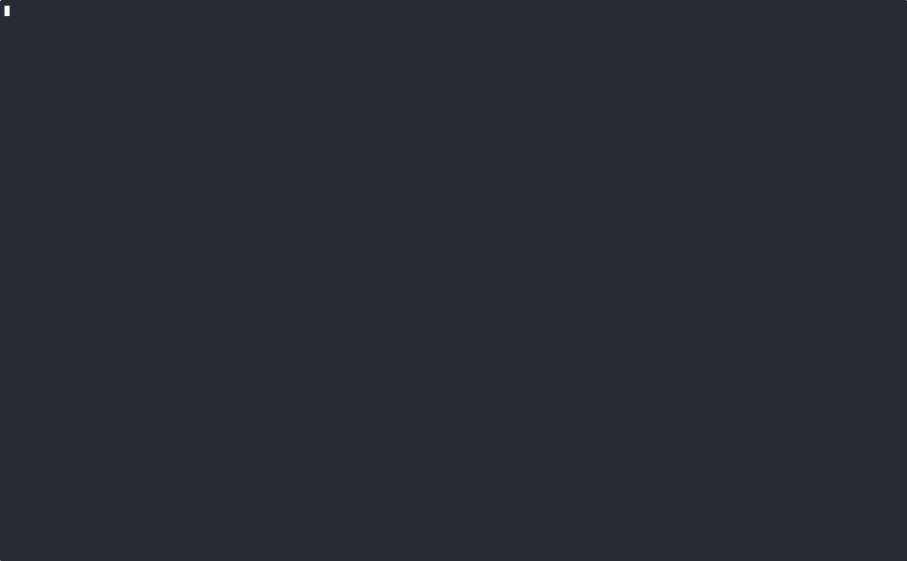
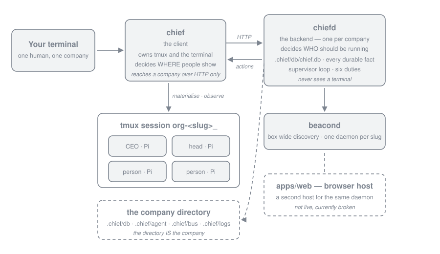

<div align="center">

<picture>
  <source media="(prefers-color-scheme: dark)" srcset="docs/assets/logo-dark.svg">
  
</picture>

# chief

**Run a company of AI agents in your terminal.**

[](https://github.com/tribes-protocol/chief/releases/latest)
[](https://github.com/tribes-protocol/chief/actions/workflows/ci.yml)
[](LICENSE)
[](https://github.com/tribes-protocol/chief/discussions)

[Quick start](#quick-start) ·
[Commands](#everyday-commands) ·
[How it works](#how-it-works) ·
[Examples](#examples) ·
[Contributing](#contributing)

</div>

chief creates and operates a persistent company of AI agents: a CEO, a
recursive tree of departments, and stable people who each have a name, a job
title, a mandate, and a private memory. You talk to them, and they talk to
each other.



## Quick start

You need macOS or Linux, [`tmux`](https://github.com/tmux/tmux), and
[Pi](https://github.com/earendil-works/pi) 0.80.10 or newer
(`npm install -g --ignore-scripts @earendil-works/pi-coding-agent`).

```bash
curl -fsSL https://chief.zipbox.ai/install.sh | sh
```

Found your first company in any empty directory:

```bash
mkdir acme && cd acme && chief
```

That opens **Founder**, which asks for exactly two things: the company's name
and its purpose. It then boots the CEO, and the CEO builds the organisation.
Tell it what you want, for example "a three-person research desk that writes
me a daily market brief", and it creates the departments, appoints the heads,
and hires the people. Come back later with `chief` in the same directory.

## Everyday commands

| Command | What it does |
| --- | --- |
| `chief` | Found a company here, or start and attach the one that exists |
| `chief ls` | List every company on this machine and its state |
| `chief attach` | Put this terminal in this company's CEO, starting it if stopped |
| `chief stop` | Stop this company's runtime, then its daemon |
| `chief stand-down [reason]` | Stop everyone except the CEO; queued mail is held, not lost |
| `chief resume` | Let the company work again after a stand-down |
| `chief reset [--yes]` | Shed the company back to CEO-only, deleting nothing |
| `chief rm [--yes]` | Remove the company for good |
| `chief upgrade [--check\|--rollback]` | Install the latest release over this one |

The full command surface, the disk layout, and the runtime are in
[`docs/OPERATING.md`](docs/OPERATING.md).

## Why chief

Most tools orchestrate agents as a flat pool of workers. chief runs a real
organisation, and everything durable in it is a row in the directory's own
SQLite database. A company survives being closed, moved, and reopened,
because the company is the database.

- A CEO and recursive departments, with named heads and specialists.
- One private Pi history, workspace, inbox, and memory directory per person.
- Messages and reminders that survive a restart.
- Durable assignments with acknowledgement, progress, escalation, and result
  delivery.
- Safe stop, restart, transfer, and removal that keep a person's history
  until you explicitly delete it.
- Parking: a quiet person costs no compute and loses nothing.

## How it works

A company is a directory. Running `chief` in it starts one **`chiefd`** for
that directory: a daemon that opens `.chief/db/chief.db` and decides *who
should be running*. The **`chief`** client owns tmux and decides *where they
are shown*: it asks the daemon over HTTP, compares the answer to the session
it can actually see, and opens, moves, and closes panes. Every person in a
pane is a Pi agent with its own home. **`beacond`**, a small box-wide
registry, answers "which daemon serves this company" and admits exactly one
daemon per company.



The code map, crate by crate, is in
[`docs/ARCHITECTURE.md`](docs/ARCHITECTURE.md).

## Examples

Three companies you can copy and found in a minute. See
[`examples/`](examples/).

| Example | The company |
| --- | --- |
| [`trading-desk`](examples/trading-desk/) | **Meridian Desk**, a paper-trading research desk: Research, Execution, and Risk, with Risk reviewing every trade memo. |
| [`growth-studio`](examples/growth-studio/) | **Signal & Co.**, a growth and social agency: Content, Distribution, and a one-person Analytics unit. |
| [`oss-maintainers`](examples/oss-maintainers/) | **Patchwork Labs**, a company that maintains an open-source repo: Triage, Engineering, and Release. |

## Contributing

Contributions are welcome, and two large pieces of work are open right now.

**1. Finish the web client.** [`apps/web`](apps/web/) is a Next.js browser
host for a company. Real code exists: the API and SSE client services, the
hooks and providers, and unit suites that run in CI on every pull request.
But it does not build a working host today, nothing a user installs contains
it, and the terminal client is the product.
[`apps/web/README.md`](apps/web/README.md) describes what it was built to do
and asks that a revival start with a
[Discussion](https://github.com/tribes-protocol/chief/discussions), with a
written account of what actually breaks.

**2. Run departments on different machines.** Today an entire company runs on
the machine where its directory lives, and a company with many active people
pegs that one machine's CPU. The goal is to let different departments be
hosted on different machines. No design exists yet; bring proposals to
[Discussions](https://github.com/tribes-protocol/chief/discussions).

Smaller work lives in the
[issue tracker](https://github.com/tribes-protocol/chief/issues). Setup,
conventions, and the pull-request contract are in
[`CONTRIBUTING.md`](CONTRIBUTING.md).

## Where to read next

| If you want to | Read |
| --- | --- |
| Understand what a company is | [`docs/WHAT_IS_A_COMPANY.md`](docs/WHAT_IS_A_COMPANY.md) |
| Operate one: disk layout, every command, the runtime | [`docs/OPERATING.md`](docs/OPERATING.md) |
| Understand the code | [`docs/ARCHITECTURE.md`](docs/ARCHITECTURE.md) |
| Contribute | [`CONTRIBUTING.md`](CONTRIBUTING.md) |
| Find any document | [`docs/README.md`](docs/README.md) |
| Report a vulnerability | [`SECURITY.md`](SECURITY.md) |

## Licence

Apache-2.0. See [`LICENSE`](LICENSE) and [`NOTICE`](NOTICE). Contributions
are accepted under the
[Developer Certificate of Origin](CONTRIBUTING.md#developer-certificate-of-origin);
sign your commits with `git commit --signoff`.
