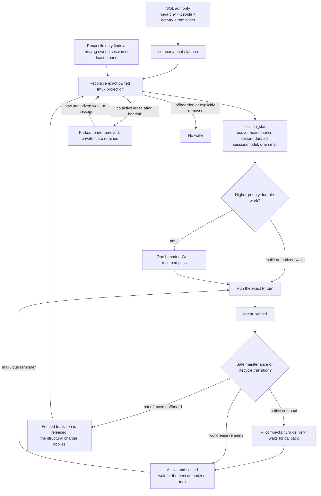
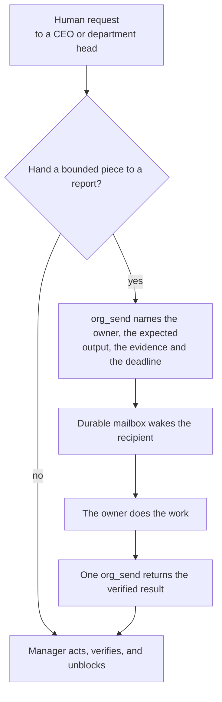
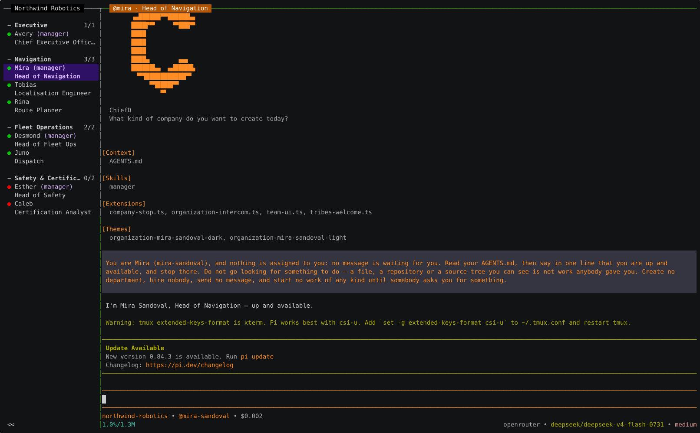

# Operating chief

The operator's reference. It assumes you have `chief` installed and a company
running; if you do not, start with the [quick start](../README.md#quick-start).

This document holds the depth that used to live in the README: the disk layout,
the startup and capacity knobs, the full command surface, and how the runtime
actually behaves. For the code, read [`ARCHITECTURE.md`](ARCHITECTURE.md); for
the durability and security invariants, read
[`ORGANIZATION_ARCHITECTURE.md`](ORGANIZATION_ARCHITECTURE.md).

## Contents

- [Install and upgrade](#install-and-upgrade)
- [The company directory](#the-company-directory)
- [The browser](#the-browser)
- [Bounded company startup](#bounded-company-startup)
- [Provider capacity is the provider's own authority](#provider-capacity-is-the-providers-own-authority)
- [An agent owns its own model](#an-agent-owns-its-own-model)
- [Company model](#company-model)
- [Source layout](#source-layout)
- [Names and command surfaces](#names-and-command-surfaces)
- [Human-facing commands](#human-facing-commands)
- [Runtime state is rows](#runtime-state-is-rows)
- [Tmux names, without the jargon](#tmux-names-without-the-jargon)
- [Supervision is duties in one daemon](#supervision-is-duties-in-one-daemon)
- [Agent lifecycle](#agent-lifecycle)
- [Messages, reminders, and work](#messages-reminders-and-work)
- [Specification](#specification)

## Install and upgrade

chief installs as a **self-contained, versioned tree** under `~/.chief`. The
installer, `bun run release`, and `chief upgrade` all produce the same layout —
nothing points back into a source checkout, so a clone is never needed to run.

### The layout on disk

```
~/.chief/
  bin/
    chief   -> versions/2.0.7/bin/chief      # symlinks, atomically re-pointed
    chiefd  -> versions/2.0.7/bin/chiefd
    beacond -> versions/2.0.7/bin/beacond
  versions/
    2.0.7/
      bin/{chief,chiefd,beacond}
      resources/            # the Pi extensions and skills every person's home is built from
      manifest.json         # version, target, Pi floor, and a checksum of every file above
  state/
    previous                # the version chief upgrade --rollback returns to
```

Each binary finds its own `resources/` by walking up from `current_exe()` —
`bin/chief` resolves `../../resources` through the symlink to the version it
belongs to. There is no environment variable and no pointer file to keep in
sync. The last two versions are kept; older ones are pruned after a successful
upgrade.

### Installing

The [README quick start](../README.md#quick-start) is the user path: the
`install.sh` one-liner downloads the latest release tarball for your platform,
verifies it against the release's `SHA256SUMS`, unpacks it into
`versions/<v>`, and points the `bin/` symlinks. Add `~/.chief/bin` to your
`PATH` and you are done. Contributors instead run `bun run release` from a
checkout — see [`CONTRIBUTING.md`](../CONTRIBUTING.md#1-set-up-a-clean-machine).

### Upgrading

```bash
chief upgrade            # install the latest release over this one
chief upgrade --check    # report installed vs latest; change nothing
chief upgrade --rollback # return to the previous version
```

`chief upgrade` needs no clone and no Rust compiler. It downloads the latest
release, verifies its checksum, unpacks it to a staging directory, runs the new
binaries' `--version` to prove they work, and only then re-points the symlinks
with `rename(2)`. Because the swap is last, there is no moment when a broken
binary is live; a failed download or a binary that will not run leaves the
current install untouched.

`chief upgrade --check` exits `0` when you are current and `10` when an upgrade
exists, so a script can ask without parsing text. A network failure or a
GitHub rate-limit is reported plainly and never blocks other work — there is no
background update check; `--check` is the only probe chief makes.

### Live companies are not interrupted

A running `chiefd` holds its binaries open, and re-pointing a symlink does not
disturb an open file on Unix — the old inode stays alive until the process
exits. So an upgrade never interrupts a running company. Afterwards, `chief
upgrade` reminds you that companies already running keep the binaries they
started with, and to restart each one with `chief stop && chief attach` in its
directory **when convenient** — it never restarts one for you.

### The Pi floor

chief declares a **minimum** Pi version — a floor, never an exact pin, so any
newer Pi passes. It is defined once, in
[`apps/chiefd/crates/host-primitives/src/pi_floor.rs`](../apps/chiefd/crates/host-primitives/src/pi_floor.rs),
and each release carries the floor it needs in its `manifest.json`. `chief`
preflight warns when the installed Pi is below the floor but does not block.
Only `chief upgrade` enforces it: if the release you are installing needs a
newer Pi than you have, it prints both numbers and offers to run Pi's own
updater (`pi update`) first — stating plainly that Pi's updater installs the
LATEST Pi, not a specific version. Decline, and nothing is changed; run `chief
upgrade --skip-pi-check` if you know better.

### macOS Gatekeeper

Release binaries are built on macOS runners, so the linker ad-hoc-signs them.
The `install.sh` and `chief upgrade` paths use `curl`, which never sets the
quarantine attribute, so Gatekeeper does not engage. If you download a release
tarball with a browser instead, clear the attribute once with
`xattr -dr com.apple.quarantine ~/.chief/versions/<v>/bin`. Developer-ID
signing and notarization are not done: they need an Apple developer account
and a human decision, and ad-hoc signing is enough for the `curl` and
`chief upgrade` paths that are how releases are actually installed.

## The company directory


Durable company state is **SQL only**, served by chiefd's typed docstore
(`apps/chiefd`; the running daemon mounts it, and there is no standalone store mode —
the store lives inside `chiefd run`).
`beacond` is the small box-wide presence registry at `127.0.0.1:6969`.
Each company has its own daemon and its own SQLite file at
`<company-directory>/.chief/db/chief.db`; no shared company store or legacy
data-root fallback exists. A command inside a company resolves that daemon
from `.chief/run/daemon.json`, while `chief ls` uses `beacond` to find companies
across the box. The CLI starts `beacond` when needed. The daemon asserts that
the store is healthy before it starts runtime work. A Rust toolchain is
required to build or test these programs.

Bare `chief` inspects the current directory. Without `.chief/db/chief.db`, it
opens Founder mode. With that database, it boots and enters the company.
`chief ls` lists all companies without changing the current directory.

Each company uses the directory in which the operator ran `chief`:

```text
<company-directory>/
  .chief/
    db/chief.db              every durable company fact
    keys/                    operator and service identity keys
    chiefd-identity.key.pem  the Chief's daemon identity key
    run/                     disposable daemon and rail rendezvous files
    log/                     Chief program JSONL diagnostics
    logs/                    Pi and company-service JSONL diagnostics
    bus/events.jsonl         bounded Pi event trail
    agent/<person>/          one create-once home per non-Chief person
      AGENTS.md
      sessions/               transcripts (PI_CODING_AGENT_SESSION_DIR)
      company -> ../../..
      chiefd-identity.key.pem
      .pi/settings.json       the person's identity theme, and nothing else
      .pi/skills/<role> -> ../../../../skills
      .pi/themes/organization-<person>-{light,dark}.json
  .pi/skills/                company skills, seeded once at genesis
```

**A home holds no Pi configuration.** chief does not set
`PI_CODING_AGENT_DIR`, so Pi resolves its own user configuration from
`~/.pi/agent` exactly as it does for any directory you run it in: one sign-in,
one provider registry, one set of defaults, shared by the operator and every
person. Only transcripts are redirected, through Pi's own
`PI_CODING_AGENT_SESSION_DIR`.

One consequence is worth stating plainly because you will see it: **the default
model is shared company state.** Anybody's `/model` moves the default that every
fresh session starts from. Sessions already running keep the model they are on.

Everything a person does own is PROJECT scope under `.pi/`, because the home is
their working directory. Pi admits project-scope skills and themes only for a
TRUSTED project, and chief passes `--approve` on every managed launch — that
flag is what delivers a person's role skill and identity theme, not merely what
spares them a prompt.

The Chief is the operator's own Pi in `<company-directory>` and has no managed
agent home. `beacond` is only the discovery layer a caller queries to find the
company's daemon; it is not a shared state store. There is no legacy data-root
fallback or migration.

## The browser

`scripts/start-stack.ts` boots the whole local stack and prints every address:

```
bun scripts/start-stack.ts

  chief — local stack
    beacond   http://127.0.0.1:6969      company discovery
    chief     http://127.0.0.1:8789      company create/boot/stop
    web       http://localhost:3000      open this to create a company
```

Open the web address and create a company there — that is the flow the
program is built around (`#751`: "a browser can create a company (founder →
CEO), see the org as window-tabs and panes, talk to any agent"). A company's
own chiefd starts with the company; there is one per company and every client
finds it through beacond.

`bun run web:dev` runs the web app alone, without starting beacond or the
`chief host` lifecycle surface — use it when those are already up.

The browser is a full second **host**, not a viewer. It builds every tool
chiefd granted a person — Pi's extension registrations are adapted into the
agent's tool list with no filter, and anything that cannot be built is reported
in `unavailable` rather than dropped — and it drives that person's lifecycle
from chiefd's own `GET /v1/docs/watch` change feed, so a reminder or a message
wakes its owner over a socket read rather than a timer. It measures real context
usage, compacts at Pi's own threshold, replaces a session at an idle boundary,
and serves the reading at
`GET /api/companies/:slug/people/:personId/runtime`. It names no tmux socket, no
session and no pane id anywhere; its `paneId` is a person id.

There is exactly one pre-company identity, **Founder**, and it carries the
full toolset. The second pre-company identity and the verb that opened it are
gone — with one identity left they were two ways to do one thing.

`chief` is the operator client: it owns tmux, the terminal and every verb
above, and it reaches a company only over HTTP. `chiefd` is the backend
that serves a company; `chief` spawns it per company and `exec`s it for the
daemon modes, so `chiefd run` and `chiefd run` are the same invocation.
Two programs, one front door.

## Bounded company startup

Newly created Pi processes are always staggered. **Startup is bounded by default: an unset interval admits three processes every 1000 ms.** Both knobs are provider-neutral values in the root `.env`:

```bash
ORGANIZATION_STARTUP_STAGGER_MS=1000   # interval between admission steps (0–60000)
ORGANIZATION_STARTUP_CONCURRENCY=3     # processes admitted per step (1–64)
```

Omitting either keeps the safe default — and so does an out-of-range or unparseable value, because a timing knob may never fail a launch. Only an explicit `ORGANIZATION_STARTUP_STAGGER_MS=0` restores immediate startup. On each boot or reconcile, missing Pi processes are admitted in deterministic company-plan order in groups of `ORGANIZATION_STARTUP_CONCURRENCY` at `0`, `N`, `2N`, and so on. A separate safety cap admits at most eight starts per reconcile pass whatever the configured concurrency; the remainder defers to the next pass, which the pass itself nudges awake. Raising concurrency therefore shortens a wide company's ramp without ever removing it.

Starting several departments in a row is several separate reconciles, and the ramp carries across them. The company's `runtime` row records the instant this pass's ramp ends in `startup_admission_until`; the next pass reads that back as its own starting offset — clamped to ten minutes rather than rejected — so back-to-back department starts keep ramping instead of each restarting at zero and racing. A CEO-only genesis boot that consumed a ramp slot with nobody else to pay for it records `startup_ceo_admission_debt` instead: one ordinal slot owed to the next batch, cleared only once that batch's tmux apply has succeeded, so a failed batch keeps its one delayed retry. Both are columns of a row, readable at `POST /v1/org/runtime/read`.

Neither chiefd nor the client sleeps, and no organization lock is retained: chiefd publishes the admission delay, and the client wraps each newly minted pane so the **pane itself** sleeps it before `exec`ing the agent (`chief-cli/src/actuate/spawn_cmd.rs`). Killing that pane or the company cancels its pending start. Already-correct panes, mailbox delivery, supervision, layout, and status updates remain immediate.

## Provider capacity is the provider's own authority

#748 removed the provider-admission pool: a fresh managed Pi turn calls its
configured provider transport directly, with no `before_provider_request`
gate, no admission subprocess, and no ChiefD SQLite pool in the path. Provider-native authentication, 429 /
`Retry-After`, and Pi's own retry behavior pass through unchanged, and the
provider owns capacity limits. `ORGANIZATION_PROVIDER_MAX_CONCURRENCY` is
gone from fresh pane argv and environment; a legacy ambient value is inert
and cannot abort or delay a turn.

The `provider-admission acquire|release` surface and its caller-auth exemption
are gone with it, not kept as a no-op shim
(`chiefd-core/src/caller_auth.rs`); the table it drained is absent from the
schema (`chiefd-core/src/schema.rs`, delta #68).

## An agent owns its own model

There is no provider allowlist. A live model change is fenced on *who* may make
it — self-only and authenticated — and
not on *what* they may switch to, so any agent may switch to any model its
deployment can actually serve. The only requirement on a vendor is a real
transport contract: a custom provider must declare `baseUrl` and `api` in the
operator's root Pi catalog, which is a configuration precondition rather than a
policy boundary. Switching model alone never reroutes an agent onto another
vendor, because an unknown model keeps the provider already serving that person.

An `ORGANIZATION_ALLOWED_MODEL_PROVIDERS` left in a legacy `.env` is inert and
restricts nothing.

Run `chief --help`, or `chief <verb> --help`, for the CLI's own help. Every operator verb is answered by the `chief` binary; the repo's `bun run` targets are development entry points, not the product surface.

## Company model

Companies live under `~/.chiefd/orgs/<slug>/`, never beside the source checkout. ChiefD's normalized SQL tables are authoritative for the complete unit hierarchy and staffing graph: `departments` holds one row per company, department or contract node under a unique root, a unique head and a sibling ordinal; `people` holds one row per person with their home and assigned department; and the `person_tools`, `person_resources`, `person_prompts` and `person_contracts` satellites carry each person's capability plan. There is no `org.json` and no JSON projection of any of it. Tmux labels and runtime snapshots are derived observations; they never decide ownership.

Units—not people—form the recursive hierarchy. The root is a durable `company`; normal child units are durable `department` records; bounded work may use a transient `contract` unit. A department or contract can contain either kind of child unit.

- The CEO appears in the company window.
- A department head appears in its parent department's window.
- A worker appears in the window of their currently assigned department.
- People have stable company-global directories, so a transfer never moves or duplicates sessions, mail, workspaces, or memory.
- Creation is staged and atomically renamed. A failed create cannot leave a ghost company that blocks retry.
- Structural changes are graph-validated and atomically committed by direct SQL operations.

New here? Read [What is a company?](WHAT_IS_A_COMPANY.md) first, then the
concise [architecture overview](ARCHITECTURE.md). The detailed
[organization architecture reference](ORGANIZATION_ARCHITECTURE.md)
captures delivery sequencing and durability invariants.

## Source layout

The tree follows the runtime boundaries rather than a flat collection of files.
There is no root `src/`:

```text
apps/chiefd/crates/   the product, in Rust
  chiefd-daemon/        the backend binary: `run`, `bootstrap-store` and the
                        two operator-support modes (`set-actuation-config`,
                        `clear-breaker`). Installed as `chiefd`.
  chiefd-core/          the typed docstore — the manifest and every ledger, as SQL
  chiefd-api/           the HTTP surface over that store
  chiefd-host/          everything the BACKEND touches on the machine
                        (materialize, health). It names no tmux in code:
                        `scripts/test/backend-tmux-boundary.test.mjs`
                        fails if any file under the four backend crates does.
  chief-cli/            the operator client, installed as `chief`: tmux, the
                        terminal, `host`, and every operator verb, over HTTP
                        only. Depends on none of the four above — it is a
                        frontend, and the guard above enforces that both ways.
  beacond/              the small no-auth discovery daemon
apps/web/             the browser client, and a full second host for a person
packages/chiefing/    the TypeScript client of chiefd and beacond. No business logic above it.
packages/piing/       Pi artifacts: the skills and extensions copied into Pi homes
packages/eslinter/    the repo's own lint rules
packages/testing/     shared test harness
```

Extensions and skills under `packages/piing/` are copied into Pi homes; they
must stay self-contained. See [Architecture](ARCHITECTURE.md) for the data
flow.

## Names and command surfaces

- **chiefd** is the product, and the `chief` binary is the whole front door. There is exactly one pre-company identity, **Founder**. The durable object a human creates and operates is a **company**.
- **Company** is the root unit and the only normal lifecycle vocabulary. Bare `chief` and its lifecycle verbs operate the company in the current directory; there is no copied or parallel object or `tribe` command alias.
- **Organization** is the implementation-wide aggregate. Its expert/internal control surface — staffing, mail transport, maintenance, reconciliation — is reached through chiefd's own API and the Pi tooling chiefd generates, never through a second CLI in this repo.

## Human-facing commands

The normal surface is intentionally small, and it is the `chief` binary's,
not this repo's. Everything below is answered by the installed binary
(`install.sh` puts it on your PATH; `bun run release` does the same from a
checkout). There is no TypeScript CLI in this
repo and no code path in which the binary hands an argument to a JavaScript
process: chiefd answers every verb itself, including `chief`, whose
Founder session it opens by spawning Pi directly. Pi is the agent runtime and
is a Node program; that is the only JavaScript chiefd starts.

| Command | Purpose |
| --- | --- |
| `chief ls` | Every registered company and its state — `running`, `stopped`, `missing` (a registry row whose data root is gone; remove it with `chief rm`) or `unknown`. |
| `chief` | Open Founder mode if this directory has no company. Otherwise, start and attach to this directory's company. |
| `chief attach` | Start this directory's company if it is stopped, then attach. It asks no confirmation. Repeated attaches reuse the same session, panes, and daemon. |
| `chief stop` | Stop this directory's chiefd and tmux session; durable state is kept. |
| `chief reset` | Return this directory's company to a CEO-only fresh state. Deletes no durable state: mail, skills, model, identity and private history remain intact. |
| `chief rm` | Remove this directory's company for good: stop it, delete `.chief/`, then drop its discovery row. The one verb that deletes durable state, and it asks before it does. |
| `chief actuate` | Run this directory's people from this terminal, and stay open. `chief attach` starts one for you. |
| `chief topology` | Print where this client would place every desired person. Starts nothing. |
| `chief host` | The per-box lifecycle surface clients call to create, boot and stop a company. Started for you by `bun scripts/start-stack.ts`. |
| `chief upgrade` | Install the latest release over this one. `--check` reports without changing anything; `--rollback` returns to the previous version. See [Install and upgrade](#install-and-upgrade). |

### Loading a NEW BINARY into a running company

**`chief` alone will not do it.** A bare `chief` in a company directory
ATTACHES to the daemon that is already running — which is the right behaviour
for the everyday case and the wrong assumption for a deploy. The running daemon
goes on being the old binary no matter how many times you run `chief`.

To pick up a newly built or newly installed binary:

```
/stop        # from any pane in the company — or `chief stop` in its directory
chief        # starts the company again, on the new binary
```

This is written here because its absence cost an operator four deploy attempts
in one afternoon: each `chief` re-attached, the old daemon kept serving, and
nothing in the output said why the change had not landed.

`/stop` is decisive and total for the company — every person, the window, the
daemon — and durable state is untouched: goals, mail, memory and assignments
all survive. It leaves `beacond` alone, which is company-agnostic and shared.

Development entry points in this repo, for working ON chiefd rather than with
it:

| Command | Purpose |
| --- | --- |
| `bun run release` | Install dependencies, build `chief`, `chiefd` and `beacond`, publish all three under `~/.chiefd`. |
| `bun run release:fast` | The same, with dev-tuned cargo settings. Never ship a binary built this way. |
| `bun scripts/start-stack.ts` | Boot the whole local stack (beacond, `chief host`, web) and print every address. |
| `bun run web:dev` | Run the web app alone. |
| `bun run test` | Run every package's unit suite. |
| `bun run typecheck` | Type-check without emitting files. |
| `bun run lint` / `bun run lint:fix` | Lint (and fix + format) every workspace member. |
| `bun run lint:reactive` | Scan for polling/blocking/locking against the reactive mandate. |
| `bun run knip` | Sweep for unused files and undeclared/unused dependencies. |
| `bun run test:pre-push-guards` | Run every repo-invariant guard under `scripts/test/`, derived from the tree, with no cargo build. |

Anything else under `scripts/` is invoked directly (`bun scripts/<name>.ts`,
`node scripts/<name>.mjs`, `bash scripts/<name>.sh`) rather than given a
`package.json` target — the root script table is a menu for a human, not an
index of the repo.

**Who does what.** chiefd decides WHO should be running; the `chiefd` client
decides WHERE, and is the only program that speaks to tmux. `chief actuate
<company>` is that client running: it observes its own tmux, posts what it saw
to `POST /v1/org/runtime/observed`, reads the person-scoped actions chiefd
publishes at `POST /v1/org/runtime/actions`, fetches the launch catalog at
`POST /v1/org/runtime/launch-catalog`, and applies. It holds a short actuator
lease and reports its own id, so chiefd can tell "nobody is listening" from
"nothing to do". **A company with no attached client is un-actuated** — chiefd
reports that as a first-class state (`presence: "never-attached" | "lapsed"`,
`withheld: "no-actuator"`), not as an error and not as silence.

**Bare `chief` or `chief attach` in the company directory takes you from nothing to a running CEO**, and
the order it does three things in is the product. It makes an actuator present,
waits for that actuator to take chiefd's lease, and only then states CEO-only
intent — because intent stated while nobody is actuating is silently lost: the
route answers `{"prepared":true}`, the CEO stays `desiredActive: false` forever,
and you get a healthy daemon, a 200, an encouraging line of output and no
company. Presence alone is not enough either; both halves are required. The
actuator gets its own tmux session, `chiefd-actuator-org-<slug>_`, on the
company's own socket — never inside the company session, whose untagged
occupants its own first observation would reap. `chief actuate` remains a verb
for an operator who wants that process in a terminal of their own; nobody has to
type it.

Runtime commands never infer tmux ownership from `$TMUX`, display names, or pane contents. Normal human lifecycle commands read the durably recorded socket/session claim; expert overrides must provide both `--socket` (the tmux `-L` server name) and the exact session name, which is derived as `org-<slug>_` and stored nowhere. The one active claim is the company's `runtime_owner` row: socket, session, `claimed_at`, `validated_at`, and a status of `active` or `released` — a released owner is a real recorded state with no socket, not an absent row. The audit that decides whether a projection is live runs in the CLIENT, which is the only side that can see a tmux server; takeover is allowed only once absence has been *proved*, and an audit that fails or comes back untrusted is not proof. A new unit's complete capability plan is preflighted before its unit or head is committed. The `runtime` row is an observation carried beside an explicit in-progress target (`recon_phase`, `recon_started_at`), so UI and mailbox readers never mistake healthy panes for absent or start a competing projection. Its `panes` map is keyed by PERSON, and each value is the process handle the actuator reported — the pid as a string, or the empty string when it proved a person alive without reading one. The client reports people and processes, never pane ids, because naming a tmux target is the client's business alone (`chief-cli/src/actuate/report.rs`). Backend readers take only the keys, as the set of people the runtime carries; read an empty value as *no pid was readable*, never as *no process*. Direct messages and supervision effects use the same lock-free read: an exact current live recipient drains durable mail when the docstore's change stream announces it, with a 60-second fallback tick that stays suppressed while that channel is healthy; a parked/missing or unsafe recipient requests convergence, and a current marker leaves the envelope durable for the reconcile duty's next pass. Duplicate, foreign, partially tagged, or unprovable ownership fails closed.

## Runtime state is rows

Every runtime fact chiefd owns is a row in that company's own SQLite database. There is no `runtime.json`, no `location.json`, no pid file, no `state/` directory, and no JSON projection of durable state anywhere outside a Pi home — the mandate is stated in `chiefd-host/src/runtime_lifecycle.rs` and enforced by the materializer, which asserts the tree it stages contains no such file. The only things chiefd writes into a company directory are Pi homes, agent workspaces, the shared service directories, and diagnostics nobody reads back as authority.

| Runtime fact | Where it lives | Read it at |
| --- | --- | --- |
| Which socket and session own this company | `runtime_owner` — one row, `active` or `released` | `POST /v1/org/runtime-owner/read` |
| What the runtime currently looks like | `runtime` (socket, status, ramp and recovery columns) with `runtime_panes` (person → the actuator's process handle + its `@organization_launch_hash` tag), `runtime_recovery_people`, `runtime_monitor_warnings` | `POST /v1/org/runtime/read` |
| Who is actuating, and whether they could vouch for what they saw | `runtime_actuation` (actuator id, report time, lease, `observation_trusted` and its reason), `runtime_actuation_people`, `runtime_actuation_unknown` | `POST /v1/org/runtime/observed`, `POST /v1/org/runtime/actions` |
| Who should be running, and why | `person_activity` (`last_desired_active`, `idle_since`, last home/assigned/pane department, employment state, active transition), `activity_meta` (the round-robin park cursor), `launch_intent` (presence *is* the intent) | `POST /v1/org/activity/read` |
| Whether each supervision duty is alive | `supervisor_watermarks` — one row per duty with its declared interval, `last_success_at`, `run_count`, and the most recent failure only, cleared on the next success | folded into the health monitor's durable facts |
| One-time events that must happen exactly once | `event_once_markers`, keyed `(slug, sha256(event id))` | `POST /v1/org/event-journal/read` |
| Health observations and incidents | `health_monitor_observations`, `health_monitor_incidents` (capped at 200), `health_monitor_cursors`, `health_monitor_terminal_resolutions` | `POST /v1/org/health-monitor/read` |
| A person's operating contract | `person_contracts` (text + digest), projected to exactly one file: `workspace/AGENTS.md` | `POST /v1/org/person-contracts/read` |

Two directories under a company are still written to, and neither holds state. `logs/exceptions.jsonl` collects bounded redacted diagnostics from the background-memory worker and the Pi extensions, and the health monitor reads that directory — bounded, cursor-tracked, and never as authority. `bus/events.jsonl` is an append-only diagnostic trail written *by the Pi extensions*, not by chiefd; see [Reliability boundaries](#reliability-boundaries). Two more logs sit outside any company directory: `~/.chiefd/logs/chiefd-store.jsonl`, the store's own structured sink, and `~/.chiefd/run/<slug>.log`, one daemon's raw stdout and stderr — whose only consumer is the message that quotes its last lines back to you when a boot fails.

## Tmux names, without the jargon

- A **socket** is the named tmux server (`tmux -L <socket>`). It is only relevant when a machine runs more than one tmux server.
- A **session** is the named collection of tmux windows inside that server. A company's session name is always `org-<slug>_`, derived from the slug rather than stored anywhere. The trailing `_` is a terminator: tmux resolves a target by PREFIX when nothing matches exactly, and a slug can never contain `_`, so a probe for a stopped `acme` can never be answered by a running `acme-corp`.
- Normal human commands infer both values from the company’s durable ownership record. Do not type them for `attach`, `stop`, or `reset` unless recovering or automating a nonstandard server.
- `--socket` and `--session` are an all-or-nothing expert override. They exist for scripts and incident recovery, never as routine setup work.

## Supervision is duties in one daemon

There is no separate supervisor process. Launching a company starts exactly one detached `chiefd run` daemon for it, and supervision is six duties inside that one process: reconcile, health monitor, mailbox wake, deadline evaluation, reminder dispatch, and background memory. That list is canonical — a duty added to the cycle without a watermark is a duty whose silence nobody would notice. What stops a copied or renamed checkout from starting a competing one is `beacond`: registration is a single `BEGIN IMMEDIATE` keyed by the company slug, and a slug already registered to a live pid is refused rather than replaced.

None of that is a lock, deliberately. Serialization is structural at three layers: beacond admits one daemon per company before its storage opens; that daemon's writer actor is one thread running one `BEGIN IMMEDIATE` per mutation; and every converge pass, triggered or duty-driven, runs under a durable single-flight claim in the `converge_safety` row, so a second concurrent pass is skipped rather than queued. The `.org.lock` and `.runtime.lock` files — and the tmux writer lease that briefly replaced them — are deleted, not ported. The one mutual-exclusion object left is the CEO boot lease, and it is not serializing writes: it fences an attended CEO-only boot's slow pre-converge phase against the reconcile duty, which is a window no transaction spans.

Duties are event-driven rather than polled. A row change wakes the duty that cares about it through the docstore change feed; with nothing to do, a duty sleeps to a fallback floor of sixty seconds — the backstop for the state that has no event source at all (a pane that died, a rebooted box), which is why the periodic pass exists and is not removed, and the health monitor sleeps instead to its nearest armed 15-second confirmation deadline. The 30-second and five-minute cadences each duty declares are liveness *expectations* — what the startup self-audit measures silence against, three windows before it raises — never wake rates. Each duty folds its `last_success_at` and `run_count` into `supervisor_watermarks` inside the same transaction as the work it just did, so a duty cannot report success for a commit that did not land; its most recent failure stays on the row until the next success clears it.

Reconcile compares the ownership-audited pane identities against exactly the people whose `person_activity.last_desired_active` is true. A missing or extra owned pane invokes the normal safe reconciler immediately, while an exact healthy set keeps the low-cost path. After reconciliation returns, a fresh fail-closed ownership audit must match current activity exactly before the pass may claim health or recovery, so an immediately exiting replacement remains a crash rather than false green state. A missing session is rebuilt from the durable graph; a foreign or partially tagged session is recorded and refused, never killed or adopted. Crash and recovery facts are columns of the `runtime` row — a fingerprint, when it was observed, and whether the 15-second confirmation has been met — beside `runtime_recovery_people`, which names each person the audit found missing or unexpected. Consequently a crashed whole tmux session or dead monitored/assigned pane is restored without respawning idle people or interrupting surviving panes. The daemon owns no Pi context and creates no business lease. Explicit company stop terminates it and its tmux session before releasing socket ownership, so deliberately stopped companies stay stopped, and a stale ownership row is recovered safely on the next launch.

For ordinary interactive recovery, run bare `chief` or `chief attach` in the company directory. Either command starts a stopped company immediately and opens it. Starting a company does not delete or reset durable state, so it does not ask for confirmation. The explicit socket/session override form remains available for automation and lifecycle tooling that must name a tmux target without attaching a client.

## Agent lifecycle



The root executive remains the human-facing control plane. Other people consume compute only while durable authority gives them a lease: unread mail, or an authorized wake request or durable handoff. An armed reminder does not create a business lease by itself: chiefd delivers a due reminder by waking its owner, so nothing has to stay up to receive one. When many leases disappear together, normal reconciliation admits at most two idle parks through a durable round-robin cursor; the remaining panes stay stable under explicit backpressure and do not retain their manager chain. After each park transition is released, the pane exits and the next reconcile admits the next pair while identity, sessions, memory, mailbox, workspace, model, skills, and audit history stay put. **Parked** is chiefd's sleep state: it means no pane and no compute, not a deleted person.

Mail is durable before wake. A live recipient drains it in process; a parked or missing but operational recipient is requested in the next reconciliation. A stopped unit, departed person, or explicit removal intent cannot be revived by stale mail or reminders. On process restart, pending mail replays from the store; the reconcile duty re-audits ownership on the next change or fallback tick and restores only missing chiefd-owned panes, never foreign or intentionally idle ones.

chiefd-authored mail is rendered as a neutral system card, never as a message from an organization person. Known notices identify their purpose, affected person or readable work, next action, and whether normal work is blocked; malformed or newer notice types use a bounded `⚙️ System notice` fallback without displaying raw payloads or opaque internal IDs.

Compaction uses Pi's native `compact()` operation—there is no chiefd-invented transcript summary. Managers may queue it for settled people; immediately before an automatic park, chiefd also queues it once when context usage is above 50%. Mail and resume turns wait until Pi's completion/error callback, `Nothing to compact` is a safe skip, and private JSONL history and artifacts remain durable.

Human `company reset` and `company compact` requests are one durable, atomic fan-out over the current roster. Cooperative mode waits for each person's next safe settled boundary; `--force` records the exact live Pi claim, interrupts that turn through Pi's supported abort path, and then gives maintenance priority over mail and ordinary work. A stopped company gives every target a maintenance-only wake, including otherwise parked people, and keeps the whole company behind one gate until every target is completed, failed, or skipped; idle recovery and messages cannot start early. Reset asks Pi itself to create a new native session in the same owned pane and process—no tmux injection, pane kill, history deletion, or chiefd-authored summary—and preserves model/provider selection, mail, skills, identity, and placement. Identity-fenced claims and terminal receipts use the short dedicated maintenance ledger, retries are idempotent, malformed state fails closed, and a removed person remains terminal audit history rather than being recreated.

The separately confirmed per-person **fresh session** recovery operation remains exceptional manager tooling: it replaces only the exact owned pane after settled work. Old private JSONL remains on disk in both forms.

“Permanent” has two distinct meanings, and neither one deletes a person. `offboard` marks a person departed and makes recall/wake invalid while deliberately retaining identity, sessions, memory, and audit history. Confirmed department/contract removal deletes the unit subtree and **offboards** every person homed in it — re-homed to the removed subtree's parent, `staffing_history` recording the unit they left. It deletes no person: `staffing_history` deliberately carries no people foreign key so a person's ledger outlives them, and the hard delete this replaced did not erase that history, it made it wrong — an orphaned `hired` row with no `offboarded` row and nobody it belonged to. Whole-company removal is `chief rm`, described above. Use stop or bench when later resumption is intended.

## Messages, reminders, and work

This is the definitive mental model: **a message is how work reaches a person,
and a reminder is how a person comes back to it.** Both are durable chiefd
state rather than conclusions inferred from chat, so a restart resumes the same
obligations.

| Thing | Durable meaning | Keeps a person running? |
| --- | --- | --- |
| **Message** | One durable envelope carrying information, a question, update, result, or a piece of work handed to its owner. It is the ONLY way work reaches anybody. | Yes, while it sits unread in the recipient's mailbox; it also authorizes a parked recipient to wake. |
| **Reminder** | One durable recurring wake-up, armed with `org_create_reminder` on yourself or on somebody you manage — and refused on anyone else, against the caller's own enrolled key rather than a body field. It lives in the supervision ledger, so it survives a pane restart, a chiefd restart, and a stop/relaunch. | No. chiefd wakes its **owner** — the person it names, never the manager who armed it — so it needs no standing lease. |
| **Reconcile duty** | One of seven duties in the company's single `chiefd run` daemon. It verifies the owned tmux session, advances durable delivery, and records health. It converges immediately on launch, then wakes on row changes rather than polling. | No business lease of its own. |

### From request to verified result



Handing work out never transfers accountability. The manager who asked for an
outcome still owns it, inspects the evidence, and follows up. A report's
result is one `org_send` back; a later correction is another, explicitly
labelled. Nothing is reconstructed from prose.

A manager who needs to follow up on its own cadence arms a reminder with
`org_create_reminder`. A manager with no manager of its own escalates a
human-only blocker with `org_escalate_to_operator`.

On boot or process recovery, **Work resumed** reports how many durable messages
are waiting and lists protected schedules as restart context. Pending mail and
due reminders replay from the store.

### Reliability boundaries

- A live Pi receives each durable envelope under one in-process acceptance lease. The lease ends only when Pi accepts it, Pi reports that it has fully settled with no queued continuation, or that Pi process exits. This prevents a long busy turn from receiving duplicate follow-ups; a process restart deliberately replays still-pending mail.
- Delivery effects retry through their durable outbox. A poison effect gets three bounded attempts, then is retired from the queue and becomes a deduplicated health incident instead of blocking unrelated work.
- Exactly-once effects are SQL markers, not files. One-time diagnostics insert a row into `event_once_markers` keyed by `(company, sha256(event id))`; the `INSERT … ON CONFLICT DO NOTHING` is the native form of the `O_EXCL`+hardlink marker file it replaced, so a caller-supplied id can never become a filesystem path and delivery and recovery stay O(1). The marker is the complete durable record — existence-only by design. A producer publishes the marker *first* and only then appends its human-readable line, so a crash between the two loses nothing that matters.
- `bus/events.jsonl` is that human-readable line, and it belongs to the Pi extensions rather than to chiefd — chiefd neither writes nor reads it. It is append-only diagnostic output, bounded at 128 MB with a single-file rotation, so a company directory can hold at most two files plus one in-flight line. Every persisted failure string on that path is redacted, collapsed to a single line, and truncated to 600 characters, excluding command output, ledger bodies, request/response bodies and structured payloads; chiefd applies the same 600-character redaction to every diagnostic it stores. The one deliberate exception is a captured `stderr` tail, which is allowed up to 4,000 bytes because a truncated crash tail diagnoses nothing.
- The passive health monitor is a duty of the company's own daemon, and chiefd is the only health monitor there is. It never changes agent state. It sleeps until its nearest armed deadline rather than on a fixed interval: an observation must be seen a second time 15 seconds later before it may page, so a single transient never raises. Observations, incidents (capped at 200), per-log read cursors, and terminal resolutions are rows, readable at `POST /v1/org/health-monitor/read`. The daemon separately sends one durable, deduplicated alert to the responsible manager or CEO for unresolved mailbox, gateway, runtime, or exhausted-delivery faults. A tagged pane that has been work-free for ten minutes with its idle-park transition still unreleased becomes one manager-owned incident; recovery releases that exact transition and lets normal reconciliation park it—never raw-kills the pane or creates a competing transition.

### Reading the rail



The left rail is the company. Each person carries one glyph for their real
condition: <b><span style="color:#00c500">●</span> working</b>,
<b><span style="color:#afaf00">◐</span> idle</b> (the settle clock is running),
<b><span style="color:#00bdbd">◌</span> starting</b>,
<b><span style="color:#ff0000">●</span> asleep</b>. Click a department to open
its window; click a sleeping person to wake them.

### Reading the Pi status line

- `N reminders` is the exact count of that viewer's armed durable reminders, read from chiefd's supervision ledger. It is spelled out rather than left as a bare number so the count says what it counts. Zero armed reminders paints nothing; a ledger that could not be read is shown as `reminders: unknown`, never a confident zero.
- `📬 N` is the number of durable envelopes waiting in that viewer's own mailbox. Zero, and an unreadable mailbox, both paint nothing — the footer never shows an idle `📬 0`.

### Reading the tmux tab row

chiefd-managed tabs touch with no separator. The compact `×N` suffix is tmux's live pane count for that window, so splits and exits update on the next status redraw without a manifest or runtime write. Selection changes only the tab colors; no mutable neighbor hook can leave a stale gap or count.

Open the **Work resumed** card for the human-readable waiting-work and
schedule list. If a footer and a card ever disagree, treat the latest durable
roster view as authoritative and report it: stale UI state is a bug, not a
second source of truth.

Bench, recall, transfer, and offboard still run the fenced transition machinery, but not as a wait: one call prepares the transition, releases it, and applies the atomic structural operation to the person's row, then wakes reconciliation — which re-materializes their `workspace/AGENTS.md` and department symlink from that row and moves the pane. There is no `person.json`: a person's contract is the `person_contracts` table, and `workspace/AGENTS.md` is its one on-disk projection, deliberately singular after an earlier four-copy fan-out drifted apart. The transition earns its keep because a released, applied transition is what sheds launch intent and drives the pane teardown, and because the fence stops a move landing against a runtime that has since been reaped — not because anything is collected from the pane on the way out. A finished person moves immediately, and a retry after a crash is idempotent: it reuses the recorded transition rather than minting a second one.

Department stop and confirmed removal use the same durable lifecycle intent. Once the recorded handoffs complete, ordinary reconciliation cannot consume or replace that intent; retrying the original command commits the one requested structural change. Stopped or removed units therefore cannot be woken back into service by stale mailbox or activity evidence.

Human lifecycle commands accept only their documented positional arguments and flags. Unknown flags, duplicate flags, and trailing positionals fail before any disk or tmux change; this includes every confirmed removal path. There is no second command surface: `route()` in `chief-cli/src/main.rs` answers the nine operator verbs and `RouteError::UnknownCommand` for everything else.

Mail delivery uses that same explicit runtime authority. Identity is proved by signing a daemon-issued challenge with the P-256 key materialization minted into the person's own pi-home; a person's credential is bound to that identity and its key alone.

CEOs and unit heads receive protected no-bash unit controls. Their SQL-authoritative roster labels every node as company, department, or contract and shows contract engagement, launch, and expiry metadata. `org_launch_department|org_launch_contract`, the matching stop/remove tools, and the department aliases all call direct atomic SQL lifecycle operations over chiefd's own HTTP API, fenced on the caller's verified identity; they never silently fall through to a disk-only mutation and they name no tmux target, because the daemon they call cannot see one. Heads are confined to their own recursive subtree, while the CEO may manage the complete company.

Roster runtime labels join the `runtime` observation to `person_activity` only when both describe the current durable company state. They distinguish an observed running pane, a pane held in its current window for handoff, an intentionally parked person, an explicitly stopped company, and a never-projected/absent company. During an explicitly marked reconcile they keep the last compatible pane evidence visible and label the target activity; ordinary stale, corrupt, or internally inconsistent projections still fail closed instead of being presented as live state.

`remove` is deliberately separate from `stop`: stopping preserves the durable unit and its private history, while confirmed removal recursively deletes only the selected unit subtree. Removal refuses the root unit, because removing a company is `chief rm` rather than removing its executive root. It is **one guarded transaction, not a journal**: the `unit_removals`/`unit_removal_members` tables and their `planned → manifest-committed → runtime-reconciled` phases were a `CHECK` constraint and a TypeScript type with no producer and no consumer in either language, and they are dropped rather than left described. Retry idempotency lives one layer up, in the intercom, which re-reads the manifest and treats an absent unit as success; a second removal of the same unit returns `unknown-department`.

Whole-company removal is `chief rm`, and there is no quarantine rename: the two-phase `PREPARE/QUARANTINE/FINALIZE` journal and its four tables are retired and dropped. The verb confirms, stops the runtime and the daemon through the same path `chief stop` uses, deletes the store database and the artifact tree, and drops the beacond row **last** — an order recorded as data in `chief-cli/src/remove.rs`'s `REMOVE_ORDER`. A row with no company behind it is a state the product can name (`chief ls` shows `missing`) and finish; a company with no row is unreachable.

`chief` hands the Founder's own pane into the company it just created, and only after proving the target session, the caller's pane, the socket, and the absence of prior ownership. A Founder started from inside an existing tmux session hands off from that session, not from a fixed name.

The legacy `teams/` directories and `runtime/operator.json` were removed; nothing reads them. Start a fresh company rather than attempting an in-place conversion from legacy data.

A paused unit makes its complete descendant subtree effectively stopped. Hiring, recalling, or transferring a person into that subtree is rejected, and a child cannot resume until every ancestor is active. Contract `launchedAt`/optional `expiresAt` values are validated ISO-8601 timestamps, with expiry strictly after launch.

## Specification

chiefd writes a company spec with a CEO and optional recursive departments. Each department has one head and optional staff. Workers default to benched/on-demand; heads and the CEO begin active. Model, tools, skills, extensions, and packages are explicit per person and validated before any directory is created.

See [organization-spec.md](organization-spec.md) for the schema and example.
